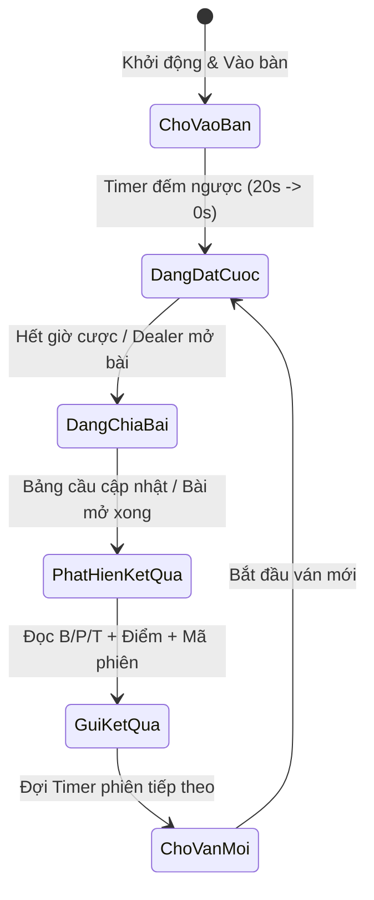

# Kiến Trúc Tự Động Hóa 100% Python (Bỏ Playwright - Dùng Vision & GUI Automation)

## 1. Tổng Quan Kiến Trúc Mới
Phương pháp này chuyển từ **Browser DOM Scraping (Playwright)** sang **Desktop Vision & GUI Automation (OpenCV / PyAutoGUI / MSS / Windows API)**.
- **Ưu điểm lớn nhất**: Không sợ Anti-bot, không phụ thuộc vào cấu trúc code HTML/iframe/WebSocket bị mã hóa của các sảnh Sexy Casino, chạy trên trình duyệt thật (Chrome/Edge) mở sẵn profile đã đăng nhập.
- **Nguyên lý hoạt động**:
  1. Mở cửa sổ game và ghim cố định vị trí/kích thước (Window Management).
  2. Tự động click theo tọa độ / hình ảnh (Template Matching) để vào sảnh & bàn Sexy.
  3. Quét màn hình thời gian thực (Realtime Screen Capture qua `mss` 60+ FPS).
  4. Bắt chu kỳ ván cược (Đếm ngược -> Chia bài -> Ra kết quả) bằng Pixel / OpenCV.
  5. Trích xuất kết quả (Banker / Player / Tie / Điểm / Mã phiên) và bắn ra hệ thống (Telegram/API).

---

## 2. Chi Tiết Các Khối Xử Lý (Pipeline)

### 📌 Khối 1: Chuẩn Hóa Cửa Sổ & Điều Khiển Tọa Độ (Window & Navigation Engine)
- **Công cụ**: `pygetwindow` + `pywin32` + `pyautogui` / `pydirectinput`.
- **Cơ chế**:
  1. Tìm cửa sổ Chrome (vd: `win32gui.FindWindow` / `pygetwindow.getWindowsWithTitle`).
  2. Cố định kích thước & tọa độ (vd: cố định góc màn hình `x=0, y=0, width=1280, height=720` hoặc `1920x1080`). Việc cố định kích thước giúp **tọa độ luôn luôn chuẩn xác 100%**.
  3. Chuỗi Click tự động vào sảnh:
     - Click vị trí Menu Casino -> Click Banner "SEXY Baccarat".
     - Click Chọn Bàn (vd: Bàn Sexy 01, 02...).
     - Nếu giao diện bị lệch: Sử dụng **Template Matching (OpenCV)** tìm icon nút để click thay vì tọa độ cứng.

---

### 📌 Khối 2: Giám Sát Màn Hình Tốc Độ Cao (Screen Capture Engine)
- **Công cụ**: Thư viện `mss` (chụp vùng màn hình siêu nhẹ < 5ms, tốn cực ít CPU/RAM).
- **Vùng cần chụp (ROI - Regions of Interest)**:
  - **ROI 1 (Trạng thái ván/Timer)**: Vùng đếm ngược đặt cược / chữ "Bắt đầu đặt cược" / "Ngừng cược".
  - **ROI 2 (Bảng cầu Road Map / Kết quả)**: Vùng hiển thị chấm tròn B/P/T của ván mới nhất trên bảng cầu (Bead Plate / Big Road).
  - **ROI 3 (Mã phiên & Điểm số - Nếu cần)**: Vùng hiển thị số Round ID và số điểm hiển thị trên bài.

---

### 📌 Khối 3: Nhận Diện Kết Quả Ván Đấu (Vision & Recognition Engine)
Có 3 giải pháp nhận diện từ siêu nhẹ đến chi tiết:

1. **Phương Pháp 1: Pixel Color & HSV Sampling (Siêu nhanh - Khuyên dùng cho Bảng Cầu)**
   - Bảng cầu Baccarat có màu cố định:
     - **Banker (Cái)**: Màu đỏ chuẩn (`RGB` / `HSV` đặc trưng).
     - **Player (Con)**: Màu xanh dương.
     - **Tie (Hòa)**: Màu xanh lá.
   - Khi ván kết thúc, ô mới nhất trên bảng cầu sẽ đổi từ màu nền sang màu Đỏ / Xanh. Chỉ cần check màu pixel tại ô đó là biết ngay kết quả với độ trễ 0 giây.

2. **Phương Pháp 2: OpenCV Template Matching (So khớp hình ảnh)**
   - Cắt sẵn ảnh mẫu các icon kết quả: `banker_win.png`, `player_win.png`, `tie.png`, `natural.png`.
   - Dùng `cv2.matchTemplate()` để so sánh với vùng kết quả, độ chính xác tuyệt đối.

3. **Phương Pháp 3: Windows OCR / Tesseract / EasyOCR (Đọc số & Text)**
   - Dùng để đọc Mã phiên (Round ID: `vd: 20260908-0125`) và Điểm số (vd: `P: 8 - B: 6`).
   - Sử dụng thư viện OCR nhẹ (như `pytesseract` hoặc `winocr`) tối ưu hóa trên ảnh trắng đen đã qua threshold.

---

### 📌 Khối 4: Máy Trạng Thái Ván Cược (Game State Machine)
Để không bị đọc trùng lặp kết quả nhiều lần trong 1 ván:


- **Logic chống trùng**: Lưu `last_round_id` hoặc vị trí ô cầu hiện tại `(col, row)`. Chỉ kích hoạt gửi thông báo khi `round_id != last_round_id` hoặc ô cầu có màu mới.

---

### 📌 Khối 5: Output & Cập Nhật Dữ Liệu (Dispatch & Notification Engine)
- Gửi kết quả ván đấu ngay lập tức:
  - Bắn qua Telegram Bot (`python-telegram-bot` hoặc `requests` call Telegram HTTP API).
  - Ghi Log / Lưu database SQLite / JSON cho các bot kéo nhóm / thống kê tỉ lệ thắng thua.
  - Tự động trigger kịch bản hô lệnh tiếp theo cho nhóm.

---

## 3. Các File Cần Thiết Kế & Cấu Trúc Module Mới

```
bot_vision_engine/
│
├── config.py                 # Cấu hình: tọa độ các nút, vùng ROI, token Telegram, cấu hình bàn
├── window_controller.py      # Module tìm, resize và focus cửa sổ Chrome / Game
├── navigator.py              # Module tự động click tọa độ / tìm ảnh để vào sảnh & bàn Sexy
├── screen_grabber.py         # Module chụp màn hình siêu tốc (mss) theo vùng ROI
├── visual_detector.py        # Module nhận diện B/P/T (OpenCV, Color Sampling, OCR)
├── game_state_machine.py     # Quản lý chu kỳ ván cược (Betting -> Dealing -> Result)
├── notifier.py               # Module gửi kết quả ra Telegram / API
├── calibrate_tool.py         # Tool phụ: GUI nhỏ hỗ trợ soi tọa độ & test cắt vùng ROI trực quan
└── main.py                   # Điểm chạy chính (Main runner loop)
```

---

## 4. Kế Hoạch Triển Khai Từng Bước

1. **Bước 1: Viết Tool Hiệu Chỉnh Tọa Độ (`calibrate_tool.py`)**
   - Tool cho phép bạn rê chuột lấy tọa độ màn hình hoặc kéo chọn vùng ROI (vùng bàn, vùng bảng cầu, vùng đếm số) lưu trực tiếp vào `config.py`.

2. **Bước 2: Viết Module Điều Khiển Cửa Sổ & Tự Click (`window_controller.py` & `navigator.py`)**
   - Auto focus cửa sổ Chrome, auto căn chỉnh độ phân giải cố định (ví dụ `1280x720`).
   - Click lần lượt các bước để vào đúng bàn Sexy.

3. **Bước 3: Viết Module Bắt Ván & Nhận Diện Kết Quả (`visual_detector.py`)**
   - Lấy mẫu màu / mẫu icon Baccarat (Banker, Player, Tie).
   - Test độ nhạy bắt kết quả khi ván kết thúc.

4. **Bước 4: Hoàn Thiện Vòng Lặp & Bắn Kết Quả Telegram (`main.py` + `notifier.py`)**
   - Ghép thành vòng lặp tự động chạy liên tục 24/7.
